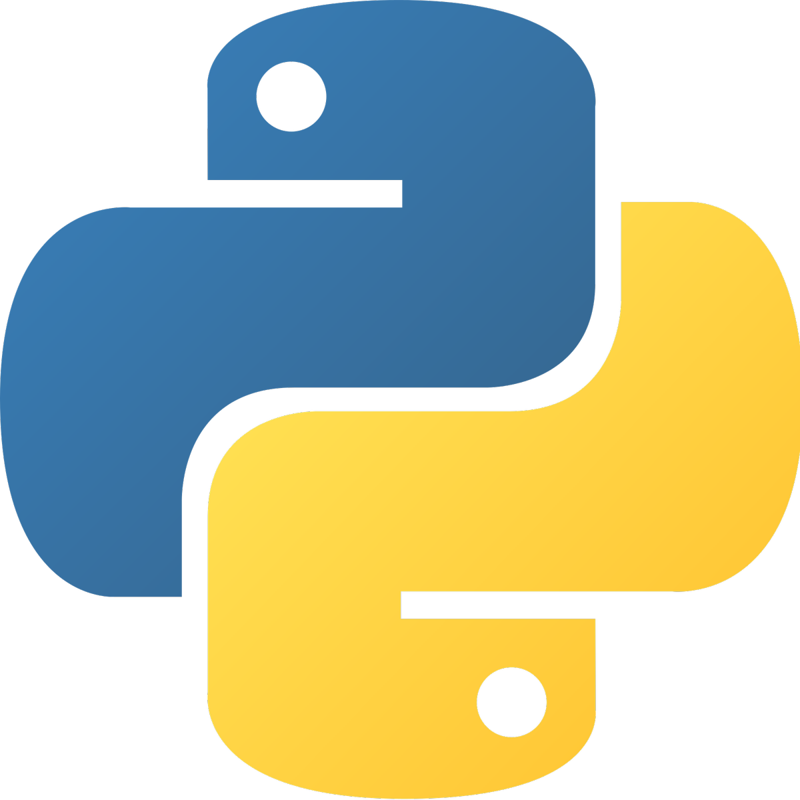
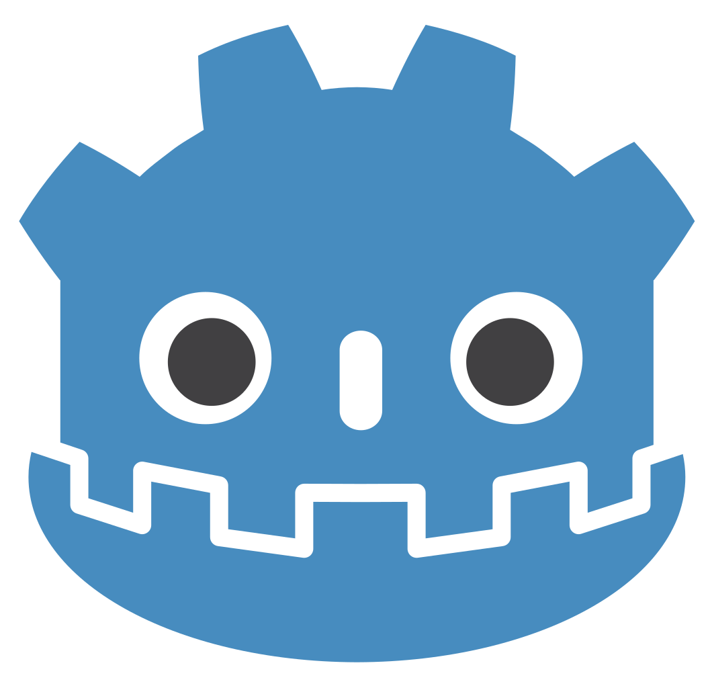
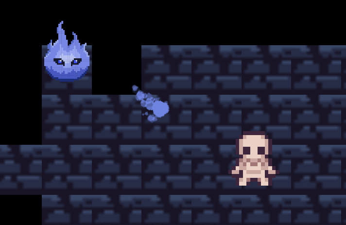
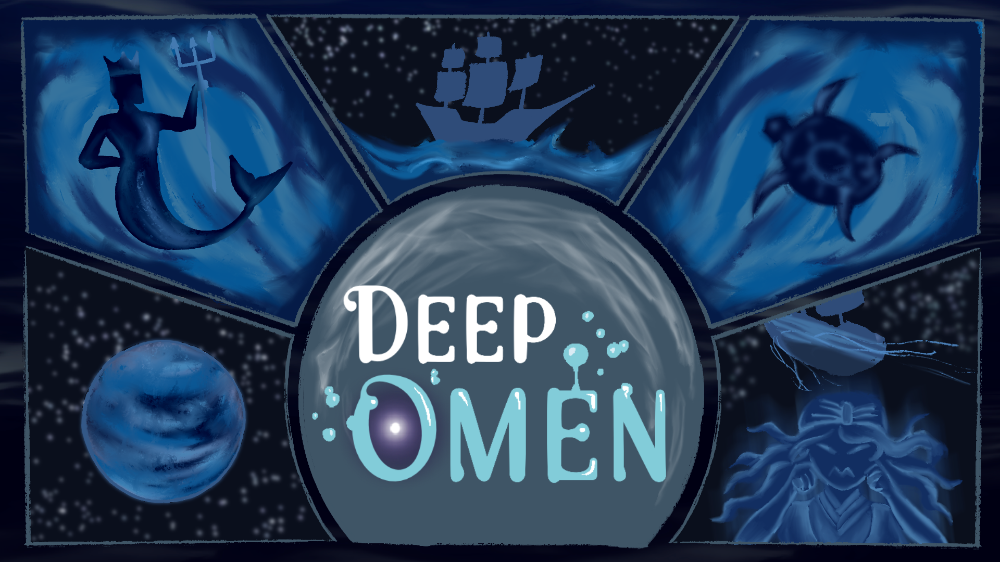
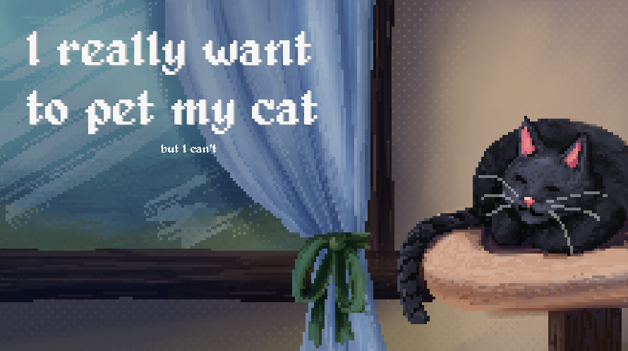

## Welcome to the Fluffy Land, a world of hopes and dreams!

I'm a fresh employee of the Onedata.org project, and I'm working now on automated tests for the Onedata app.

Besides that, I mainly develop game-related stuff and sometimes apps for Raspberry Pi/microcontrollers.

Here are my fav technologies:

  
  
  

And here are games I've done with my friends:

  
  
  
  

